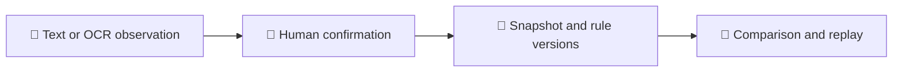

<div align="center">

# 🧩 LootWeave

**A local workbench for equipment, builds, and evidence.**

[](https://github.com/schorsch888/LootWeave/actions/workflows/checks.yml)
[](LICENSE)
[](docs/development.md#prerequisites)
[](docs/roadmap.md)

**English** · [简体中文](README.zh-CN.md)

[📦 Downloads](https://github.com/schorsch888/LootWeave/releases) · [🚀 Quickstart](#quickstart) · [📚 Documentation](#documentation) · [🤝 Contributing](CONTRIBUTING.md)

</div>

LootWeave is an open-source Windows prototype for equipment decisions.
It connects actual item facts, the complete character build, and versioned evidence.
Players do not supply stat weights.

> **🧪 Experimental:** Only the fictional knowledge pack has executable game rules.
> Deskrawl is a research target. Real-game recommendations and a production Windows release still need acceptance evidence.

## Why LootWeave

An item's value depends on its actual rolls, the complete build, and the intended use.
The workbench keeps those inputs together:

| Capability | What you can do |
| --- | --- |
| 🧩 **Equipment and builds** | Record owned items, skills, effects, and resources. Keep actual equipment separate from future plans. |
| 📷 **OCR review** | Examine captured text and images. Accept or ignore each line before you confirm facts. |
| 🔎 **Comparisons** | Examine field differences, supported mechanism changes, and missing evidence. Separate retention reasons from equip eligibility. |
| 🧰 **Preparation plans** | Record confirmed options and budgets. Examine known costs, resource gaps, and unknown prerequisites. |
| 🧭 **Measured trials** | Record actual XP and complete elapsed time. Compare trials with matching conditions. |
| 🔁 **Replay** | Keep the inputs, evidence, and rule versions for each evaluation. Replay frozen results. |

Preparation plans include equipment, skills, talents, Paragon, runes, companions, and temporary effects.
They keep feasibility separate from game-mechanic outcomes. A plan does not change the actual build.
See the [preparation workflow](docs/implementation.md#core-workflow) for confirmation requirements and blocked results.

## How it works



Observations, confirmed facts, and derived results stay separate.
Missing or conflicting evidence prevents unsupported conclusions.
See the [architecture contract](docs/architecture.md) for ownership and data flow.

## Quickstart

### Try a Windows preview

1. Download an installer or portable ZIP from [GitHub Releases](https://github.com/schorsch888/LootWeave/releases).
2. Compare its file hash with `SHA256SUMS.txt` from the same release. Use `build-manifest.json` to identify the source.
3. For the portable ZIP, extract the complete archive to a writable folder. Open `LootWeave.exe`.

The packages include the Python runtime. The portable ZIP also includes WebView2 and C++ runtimes.
Portable data stays in the adjacent `data/` folder. The installer uses `%LOCALAPPDATA%/LootWeave`.
Before you move the folder, exit the app. When you replace application files, keep `data/`.

Windows OCR uses installed language capabilities. If OCR is not available, use manual input.
See the [desktop guide](docs/development.md#build-the-windows-desktop) for build and runtime prerequisites.
Preview releases are experimental.

### Run from source

Install **Git, Python 3.12+, Node.js 24+, and pnpm 11.19.0** first.
The [development guide](docs/development.md#prerequisites) gives the setup requirements.

```powershell
git clone https://github.com/schorsch888/LootWeave.git
cd LootWeave
pnpm --dir frontend install --frozen-lockfile --ignore-scripts
pnpm --dir frontend build
python runtime.py --data-dir .local/development
```

The launcher opens a browser workbench and saves development data in `.local/development`.
Keep the terminal open. Press **Ctrl+C** to stop the launcher and its workers.
Do not share the browser session credential. For native capture, use the Windows desktop host.

On a new profile, record equipment and build facts. Confirm the facts before you save a snapshot.
Use the fictional example to examine executable rules.
See [source setup and troubleshooting](docs/development.md) for the complete workflow.

### Check the repository

These checks use Git and Python. They do not need game files or a frontend build.

```powershell
python -m unittest discover -s tests -v
python scripts/check_architecture.py
python scripts/check_public_docs.py
python -m compileall -q scripts
```

Read the results and any environment-dependent skips.
Use the [component checks](docs/development.md#validate-a-change) for changes to the frontend, native host, or research tools.

## Support and validation

| Game scope | Status |
| --- | --- |
| 🧪 `lootweave-fixture` | Fictional development data. The `synthetic-leveling` knowledge pack has executable rules. |
| 🔬 Deskrawl build `25690430` | Sorcerer leveling research includes a static Frostwyrm staff dependency path. Research packs contain no executable rules; online mechanics remain unaccepted. |
| 🗺️ Diablo II, III, and IV | Future research targets. No accepted adapters. |

The workbench offers an explicit, read-only item-template dependency query for the pinned research pack. It shows source links and unresolved online conditions without changing saved facts. See the [implementation reference](docs/implementation.md#contracts-and-invariants).

Rules stay separate by game, edition, build, mode, and season.
Real-game DPS, final drop probabilities, and global optimal routes are not validated.
The OCR parser covers three generic demonstration labels. Real-game layout coverage and independent human truth review are incomplete.
Visible GUI behavior and installation/removal on two clean Windows machines still need acceptance evidence.

The runtime uses `eager` startup by default.
The explicit on-demand experiment did not pass its declared startup-latency comparison. See the [performance results](docs/performance-results.md).

The [validation record](docs/validation.md) gives dated results and artifact identities.
Historical checks do not establish acceptance of the latest source.
Local build paths in those records are not download links.
The [CI and release contract](docs/implementation.md#github-ci-and-releases) gives rules for preview publication.

## Documentation

| Start here | Purpose |
| --- | --- |
| 🚀 [Development](docs/development.md) | Setup, commands, checks, packaging, and troubleshooting |
| 🧱 [Architecture](docs/architecture.md) | Rust/Python ownership, service calls, and storage boundaries |
| 🧩 [Design](docs/design.md) | Product scope, data model, and evidence requirements |
| 🗺️ [Roadmap](docs/roadmap.md) | Milestones, dependencies, and acceptance conditions |
| 🔬 [Research](docs/research.md) | Evidence, lawful source prerequisites, and reproduction |
| 🧪 [Validation](docs/validation.md) | Recorded measurements, build identities, and open gates |
| 🤝 [Contributing](CONTRIBUTING.md) | Contribution types, publication rules, and review steps |

More detail: [source implementation](docs/implementation.md) · [performance plan](docs/performance-plan.md) · [performance results](docs/performance-results.md).
English is the primary documentation language. The Chinese README has the same meaning.

<details>
<summary>🗂️ Repository map</summary>

| Path | Contents |
| --- | --- |
| [docs/](docs/) | Design, development, research, and validation guides |
| [research/](research/) | Selected evidence and source records |
| [scripts/](scripts/) and [tests/](tests/) | Reproduction tools and repository checks |
| [fixtures/](fixtures/) and [knowledge-packs/](knowledge-packs/) | Synthetic examples, frozen inputs, and scoped packs |
| [frontend/](frontend/) | React/TypeScript frontend with Feature-Sliced Design |
| [desktop/](desktop/) | Rust/Tauri Windows host |
| [services/](services/) | Python services for business capabilities and OCR |
| [runtime.py](runtime.py) | Local development launcher |

The architecture must use Rust + Python, one Windows EXE entry point, an FSD frontend, and DDD microservices.
Follow the [architecture contract](docs/architecture.md) for component responsibilities.

</details>

## Contributing and help

Start with [CONTRIBUTING.md](CONTRIBUTING.md).
Use [Issues](https://github.com/schorsch888/LootWeave/issues) for questions, problems, and proposals.
Include the applicable version, evidence, check results, and unknowns.
Documentation corrections, reproducibility improvements, and scoped research are useful contributions.

## Privacy and boundaries

The project processes data locally by default.
It does not access player saves or change game files.
It does not inject into games or access process memory or DMA.
It does not control gameplay or discard items automatically.

Use fictional examples in issues and pull requests.
Do not publish credentials, private screenshots, real character data, player saves, raw game resources, or downloaded tools.
Follow the [publication rules](docs/design.md#privacy-and-publication) for shared material.

## License

Project code and documentation use [Apache-2.0](LICENSE).
Third-party game content and tools keep their own terms. This license does not give redistribution rights for them.
